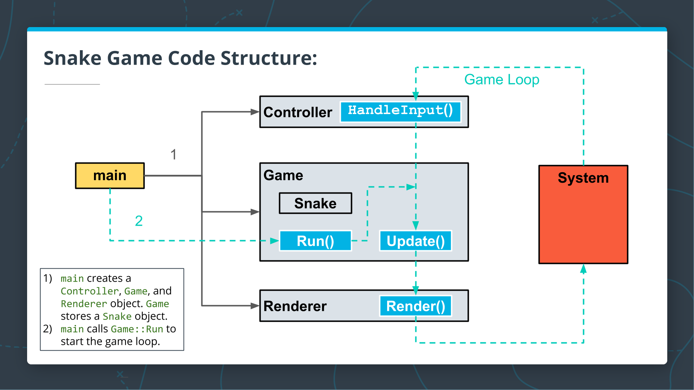

# CppND Capstone Project: Snake Game

This is the Capstone project in the [Udacity C++ Nanodegree Program](https://www.udacity.com/course/c-plus-plus-nanodegree--nd213) based on the [Snake Game Example](https://github.com/udacity/CppND-Capstone-Snake-Game) code. The code for this repo was inspired by [this](https://codereview.stackexchange.com/questions/212296/snake-game-in-c-with-sdl) excellent StackOverflow post and set of responses.

## Program Structure

## Dependencies for Running Locally
* cmake >= 3.7
  * All OSes: [click here for installation instructions](https://cmake.org/install/)
* make >= 4.1 (Linux, Mac), 3.81 (Windows)
  * Linux: make is installed by default on most Linux distros
  * Mac: [install Xcode command line tools to get make](https://developer.apple.com/xcode/features/)
  * Windows: [Click here for installation instructions](http://gnuwin32.sourceforge.net/packages/make.htm)
* SDL2 >= 2.0
  * All installation instructions can be found [here](https://wiki.libsdl.org/Installation)
  * Note that for Linux, an `apt` or `apt-get` installation is preferred to building from source.
* gcc/g++ >= 5.4
  * Linux: gcc / g++ is installed by default on most Linux distros
  * Mac: same deal as make - [install Xcode command line tools](https://developer.apple.com/xcode/features/)
  * Windows: recommend using [MinGW](http://www.mingw.org/)

## Basic Build Instructions

1. Clone this repo.
2. Make a build directory in the top level directory: `mkdir build && cd build`
3. Compile: `cmake .. && make`
4. Run it: `./SnakeGame`.

## Rubrics Covered

1. *Loops, Functions, I/O*
  * **The project demonstrates an understanding of C++ functions and control structures**: A variety of control structures are used in the project; the project code is clearly organized into functions.(e.g. while loop in line 22-50 in game.cpp)
  * **The project accepts user input and processes the input**: The project accepts input from a user as part of the necessary operation of the program. (e.g. SDL key function in line 14-40 in controller.cpp)
2. *Object Oriented Programming*
  * **The project uses Object Oriented Programming techniques**: The project code is organized into classes with class attributes to hold the data, and class methods to perform tasks. (e.g. Snake class defined in line 7-38 in snake.h)
  * **Classes use appropriate access specifiers for class members**: All class data members are explicitly specified as public, protected, or private. (e.g. line 8 and line 31 in snake.h)
  * **Classes abstract implementation details from their interfaces**: All class member functions document their effects, either through function names, comments, or formal documentation. Member functions do not change program state in undocumented ways. (e.g. line 15, 16, 29, 30 in game.h)
  * **Classes encapsulate behavior**: Appropriate data and functions are grouped into classes. Member data that is subject to an invariant is hidden from the user. State is accessed via member functions. (e.g. line 15, 27 in game.h)
